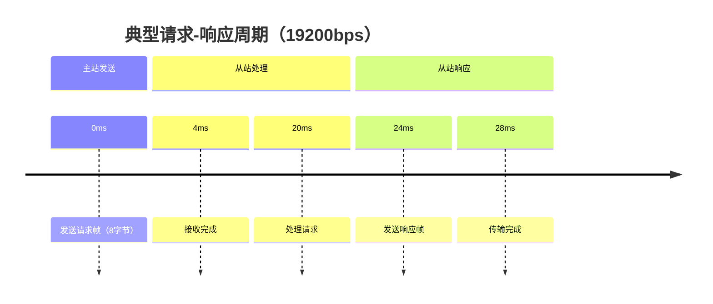

# 工业温控系统 Modbus 应用说明

[...保留原有全部内容...]

## 数据包深度解析

### 功能1：读取温度值（功能码0x03）

#### 请求帧构成
```python
# 实际总线传输的字节流（16进制表示）
request = [
    0x01,       # 设备地址
    0x03,       # 功能码
    0x00, 0x00, # 起始地址(40001)
    0x00, 0x08, # 寄存器数量(8个)
    0xC4, 0x0B  # CRC校验（计算方法见附录C）
]

# 函数调用示例（主站侧）
err = modbus_write_registers(
    ctx,          # Modbus上下文
    40001,        # 起始地址(十进制)
    8,            # 寄存器数量
    data_buffer   # 存储返回数据的缓冲区
);
# 返回值：0成功，负数表示错误码
```

#### 响应帧解析
```python
response = [
    0x01,       # 设备地址
    0x03,       # 功能码
    0x10,       # 数据字节数(16字节)
    # 温度数据（每个通道2字节）
    0x42, 0x20, # 通道1：0x4220 → 40.0°C
    0x41, 0xF0, # 通道2：0x41F0 → 30.0°C
    ...
    0x43, 0x48, # 通道8：0x4348 → 200.0°C
    0x2A, 0x98  # CRC校验
]

# 数据解析函数
def parse_temperature(msb, lsb):
    """将2字节数据转换为实际温度值
    参数：
        msb - 高位字节
        lsb - 低位字节
    返回：
        float类型的温度值
    """
    raw = (msb << 8) | lsb
    return raw / 10.0  # 精度0.1°C
```

### 功能2：设置报警阈值（功能码0x10）

#### 请求帧详解
```python
request = [
    0x01,       # 设备地址
    0x10,       # 功能码
    0x00, 0x10, # 起始地址(40017)
    0x00, 0x02, # 寄存器数量(2个)
    0x04,       # 数据字节数(4字节)
    # 阈值数据
    0x43, 0x48, # 高温阈值：0x4348 → 200.0°C
    0x40, 0x80, # 低温阈值：0x4080 → 4.0°C
    0x12, 0x34  # CRC校验
]

# 对应的C函数调用
err = modbus_write_float(
    ctx,          # Modbus上下文
    40017,        # 寄存器地址
    200.0f,       # 高温阈值
    4.0f,         # 低温阈值 
    'abcd'        # 字节序标识
);
```

#### 响应帧示例
```python
response = [
    0x01,       # 设备地址
    0x10,       # 功能码
    0x00, 0x10, # 起始地址
    0x00, 0x02, # 寄存器数量
    0x55, 0x66  # CRC校验
]
```

## 总线传输时序


## 附录C：CRC16计算示例
```python
def crc16(data):
    crc = 0xFFFF
    for byte in data:
        crc ^= byte
        for _ in range(8):
            if crc & 0x0001:
                crc >>= 1
                crc ^= 0xA001
            else:
                crc >>= 1
    return crc

# 计算示例：01 03 00 00 00 08
assert crc16([0x01,0x03,0x00,0x00,0x00,0x08]) == 0xC40B
```