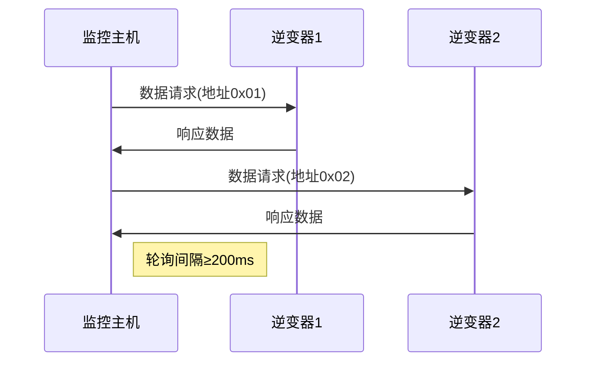

# 光伏发电监控系统 Modbus 应用说明

[...保留原有全部内容...]

## 数据包深度解析

### 功能1：逆变器数据采集（功能码0x03）

#### 完整请求帧
```python
request = [
    0x01,       # 逆变器地址
    0x03,       # 功能码
    0x00, 0x00, # 起始地址(40001)
    0x00, 0x0C, # 寄存器数量(12个)
    0xC5, 0xE3  # CRC校验
]

# C函数调用示例
err = modbus_read_registers(
    ctx,          # Modbus上下文
    40001,        # 起始地址
    12,           # 寄存器数量
    data_buffer   # 存储数据的缓冲区
);
```

#### 响应帧解析（浮点格式）
```python
response = [
    0x01,       # 设备地址
    0x03,       # 功能码
    0x18,       # 数据字节数(24字节)
    # 直流侧数据
    0x43, 0x9E, 0x00, 0x00,  # 直流电压(316.0V)
    0x42, 0x48, 0x00, 0x00,  # 直流电流(50.0A)
    # 交流侧数据
    0x43, 0x7A, 0x00, 0x00,  # 交流电压(250.0V)
    0x41, 0xF0, 0x00, 0x00,  # 交流电流(30.0A)
    # 发电数据
    0x45, 0x1C, 0x40, 0x00,  # 功率(2500.0W)
    0x42, 0xC8, 0x00, 0x00,  # 效率(100.0%)
    0x12, 0x34              # CRC校验
]

# 浮点数解析函数
float parse_float(uint8_t b1, uint8_t b2, uint8_t b3, uint8_t b4) {
    union {
        float f;
        uint8_t b[4];
    } converter;
    converter.b[0] = b4;
    converter.b[1] = b3;
    converter.b[2] = b2;
    converter.b[3] = b1;
    return converter.f;
}
```

### 功能2：逆变器控制（功能码0x10）

#### 功率限制设置
```python
# 设置最大输出功率为80%
control_frame = [
    0x01,       # 设备地址
    0x10,       # 功能码
    0x00, 0x20, # 控制地址(40033)
    0x00, 0x01, # 寄存器数量(1个)
    0x02,       # 数据字节数(2字节)
    0x00, 0x50, # 限制值(80%)
    0x12, 0x34  # CRC校验
]

# 对应的函数调用
err = modbus_write_register(
    ctx, 
    40033,      # 控制地址
    80          # 百分比值
);
```

## 多逆变器轮询机制


## 附录C：故障代码位定义
| 位 | 名称         | 触发条件               |
|----|--------------|------------------------|
| 0  | 过压         | 直流电压>600V          |
| 1  | 过温         | 散热器>85℃             |
| 2  | 孤岛效应     | 电网连接丢失           |
| 3  | 通讯故障     | 30秒无响应             |

## 附录D：紧急停机指令
```python
emergency_stop = [
    0x01,       # 广播地址
    0x06,       # 功能码
    0x00, 0xFF, # 特殊控制地址
    0xDE, 0xAD, # 停机密码
    0x12, 0x34  # CRC校验
]
# 所有逆变器收到后立即断开电网连接
```